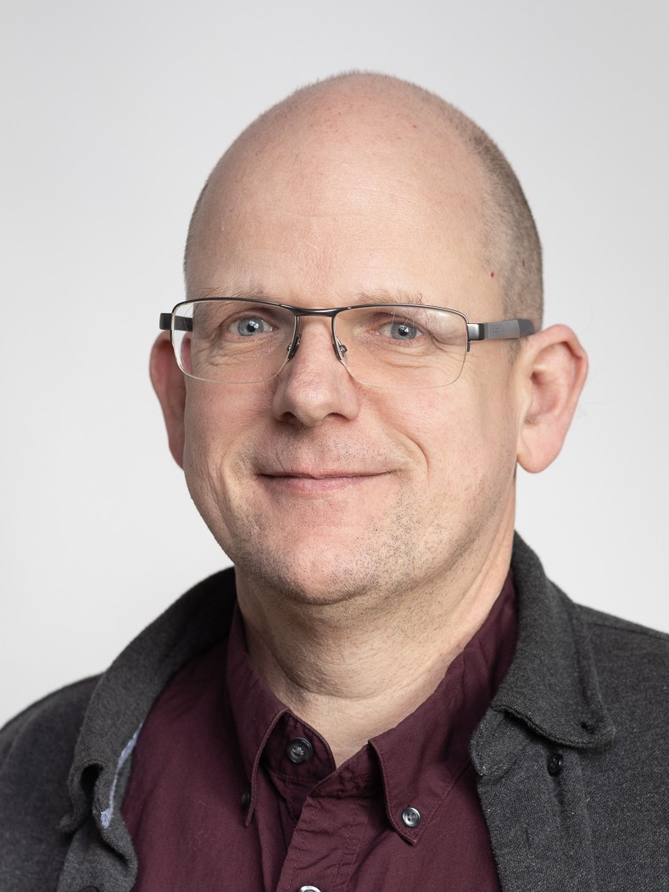
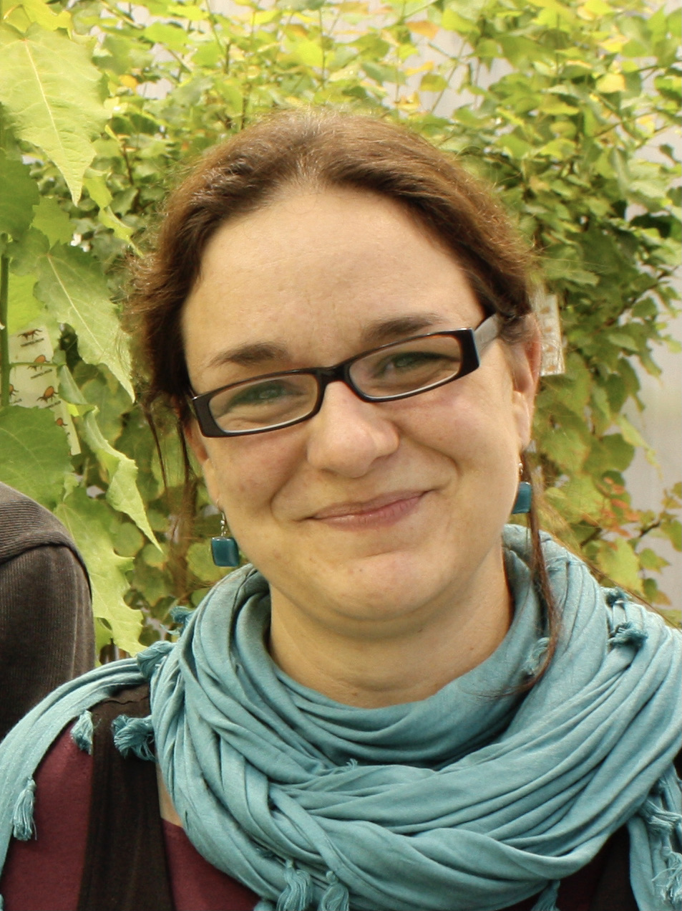
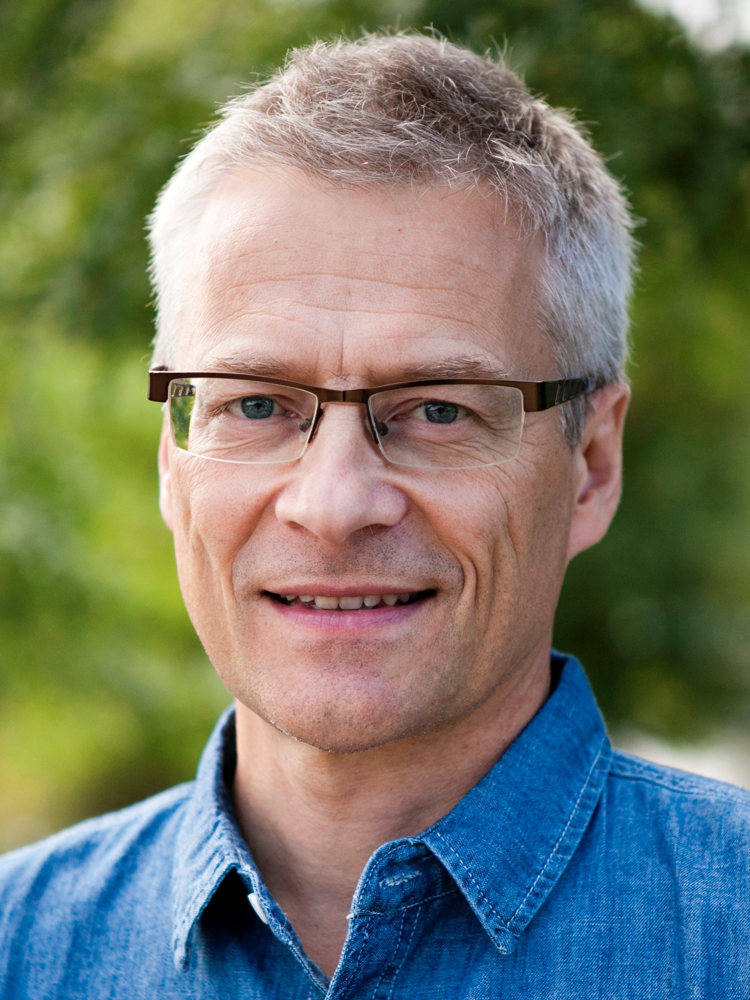
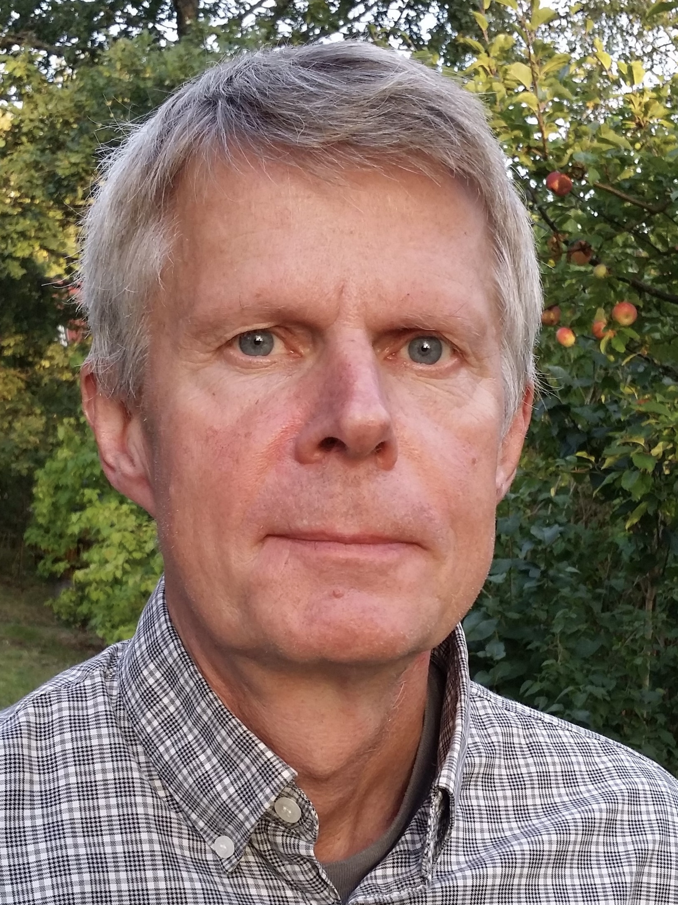

```{r setup, include=FALSE}
knitr::opts_chunk$set(echo = FALSE, out.width= "65%", out.extra='style="float:right; padding:10px"')
```


::: {.floatting}
```{r out.width='30%', out.extra='style="float:left; padding:20px"'}

```
<br><br><br>
Dirk-Jan de Koning, chair of board (VH, Ultuna)
:::


::: {.floatting}
```{r out.width='30%', out.extra='style="float:right; padding:20px"'}

```
<br><br><br>
Stéphanie Robert, board member (S, Umeå)
:::

::: {.floatting}
```{r out.width='30%', out.extra='style="float:left; padding:20px"'}

```
<br><br><br>
Anders Carlsson, board member (LTV, Alnarp)
:::


::: {.floatting}
```{r out.width='30%', out.extra='style="float:right; padding:20px"'}

```
<br><br><br>
Johan Meijer, board member (NJ, Ultuna)
:::
