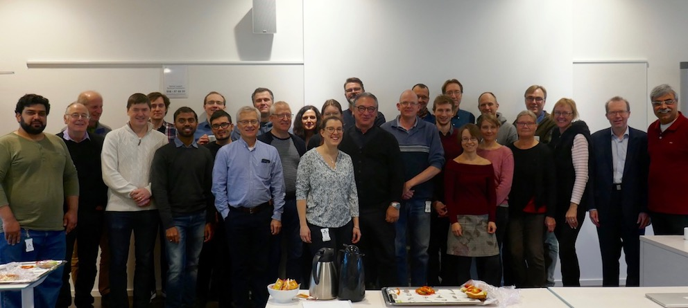

```{r setup, include=FALSE}
knitr::opts_chunk$set(echo = FALSE)
```

<center>
**Upcoming and current events:**

</center>

Course: [Introduction to bioinformatics](https://personalkurser.slu.se/kurser/kurs.cfm?KursID=PVS0141&oid=10) - Ultuna and online - autumn 2023

Course: Analysis of High Throughput Sequencing RNA-Seq Data - online - winter 2023


<center>
**Past events:**

</center>

[SLU's Day of Bioinformatics](SDB.html) - hear about exciting research at SLU, made possible through bioinformatics, autumn 2023 

<center>
  {width=60%} 
</center>

Course: Applied Bioinformatics, [MedBioInfo](https://www.medbioinfo.se/) - Ultuna, spring 2023

SLUBI day 2023, discuss the future of Uppmax, SLU computing resources and the new National Academic Infrastructure for Supercomputing in Sweden (NAISS), and have a fika with all interested bioinformaticians in Ultuna - Ultuna spring 2023

Course: Applied population genetics in plant disease epideniology, [Research School for Organism Biology](https://www.slu.se/en/graduate-schools/organism-biology/)  - Ultuna and online spring 2023

Course: [Plant Biology for Protection and Breeding](https://www.slu.se/en/education/programmes-courses/course/BI1296/30092.2122/Plant-Biology-for-Breeding-and-Protection/), Msc course - spring 2023

Course: Analysis of High Throughput Sequencing RNA-Seq Data - online - winter 2022

Course: [Introduction to bioinformatics](https://personalkurser.slu.se/kurser/kurs.cfm?KursID=PVS0141&oid=10) - Ultuna and online - autumn 2022

Course: Analysis of High Throughput Sequencing RNA-Seq Data - online - winter 2021

Statistics seminar series, arranged by SLU's [Centre for Statistics](https://www.slu.se/en/Collaborative-Centres-and-Projects/centreforstatistics/) - winter 2021

Course: [Introduction to bioinformatics](https://personalkurser.slu.se/kurser/kurs.cfm?KursID=PVS0141&oid=10) - Ultuna and online - autumn 2021

Course: Analysis of High Throughput Sequencing RNA-Seq Data - winter 2020

Course: Introduction to bioinformatics - Ultuna - spring 2020

Uppmax information meeting - Ultuna -  spring 2019

R workshop: SLUBI and the research school GS-VMAS jointly organised a R-day for researchers and supervisors. - autumn 2019

SLUBI day - summer 2018

SLUBI’s Kick-off meeting - autumn 2017


<center>
{#id .class width=60%}