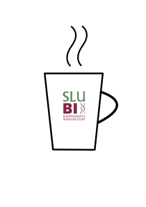

```{r setup, include=FALSE}
knitr::opts_chunk$set(echo = TRUE)
```

Meet us and other bioinformaticians for an informal fika to chat about projects, new tools or life in general. 

We meet by the colorful couches in front of the IT service center in Ulls hus. Dates and times are announced via e-mail. If you do not receive them sign up for updates via slubi@slu.se. 

<center>
{#id .class width=25%}