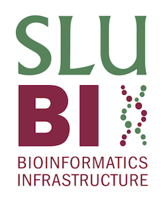

```{r setup, include=FALSE}
knitr::opts_chunk$set(echo = FALSE)

```


<center>
<br><br><br>
SLUBI computing resources:

We have local computing resources at all campuses and strive to coordinate the management of these.

<br>
Computing resources for the Swedish research community:

We would like to remind that researchers can get computing resources for free by [applying to NAISS (Uppmax and other clusters)](https://www.uppmax.uu.se/support/getting-started/applying-for-a-user-account/).

<br>
Cloud computing

SLU has an agreement with Microsoft Azure for cloud computing (including price discounts). You can get more information by contacting the SLU IT-support.

<br>
[SLUBI on GitHub](https://github.com/SLUBioinformaticsInfrastructure)

</center>
  
<center>
{#id .class width=15%}
</center>
  