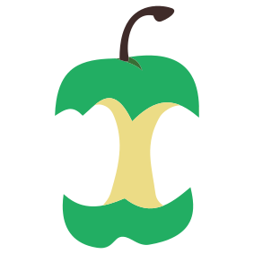
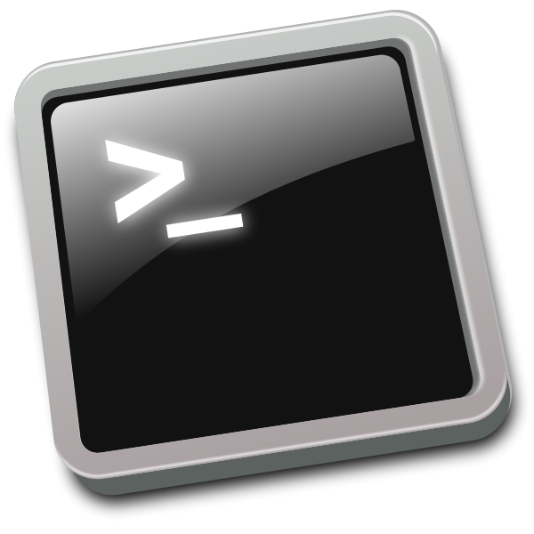

```{r setup, include=FALSE}
knitr::opts_chunk$set(echo = FALSE)

```


# tools and pipelines

::: {.floatting}
```{r out.width='20%', out.extra='style="float:left; padding:20px"'}

```
<br><br>
[nf-core](https://nf-co.re/) - Portable, documented and easy to use workflows based on nextflow. 
:::

::: {.floatting}
```{r out.width='20%', out.extra='style="float:left; padding:20px"'}
knitr::include_graphics("images/Git_square.png")
```
<br>
[git](https://git-scm.com/) - a free and open source distributed version control system designed to handle everything from small to very large projects with speed and efficiency. 
:::

# training resources

::: {.floatting}
```{r out.width='20%', out.extra='style="float:left; padding:20px"'}
knitr::include_graphics("images/swc-hex-logo.svg")
```
<br><br>
[software carprentries](https://software-carpentry.org/) - teaching basic coding skills for research computing to researchers worldwide.
:::

::: {.floatting}
```{r out.width='20%', out.extra='style="float:left; padding:20px"'}

```
<br><br>
[The unix shell](https://swcarpentry.github.io/shell-novice/) - a self paced introduction to the unix shell and command line operations, provided by the software carpentries. 
:::

::: {.floatting}
```{r out.width='20%', out.extra='style="float:left; padding:20px"'}
knitr::include_graphics("images/elixir.png")
```
<br>
[Elixir](https://elixir-europe.org/) - brings together life science resources from across Europe, including databases, software tools, training materials, cloud storage and supercomputers. 
:::

::: {.floatting}
```{r out.width='20%', out.extra='style="float:left; padding:20px"'}
knitr::include_graphics("images/Code_refinery.png")
```
<br>
[Code Refinery](https://coderefinery.org/) - teaching all the essential tools so everyone can make full use of software, computing, and data.
:::

# computing resources

::: {.floatting}
```{r out.width='20%', out.extra='style="float:left; padding:20px"'}

```
<br><br>
[SLUBI computing resources](https://www.slubi.se/) - We have local computing resources at all campuses and strive to coordinate the management of these.
:::


::: {.floatting}
```{r out.width='45%', out.extra='style="float:left; padding:20px"'}

```
<br><br>
[National Academic Infrastructure for Supercomputing in Sweden](https://www.naiss.se//) - organization for high-performance computing, storage, and data services for academic users in Sweden. 
:::


::: {.floatting}
```{r out.width='45%', out.extra='style="float:left; padding:20px"'}
knitr::include_graphics("images/uppmax.png")
```

[UPPMAX](https://www.uppmax.uu.se/) - Uppsala Multidisciplinary Center for Advanced Computational Science, HPC computing rescource for Swedish scientists. Apply for free computing projects via [NAISS](https://www.uppmax.uu.se/support/getting-started/applying-for-a-user-account/).
:::

::: {.floatting}
```{r out.width='30%', out.extra='style="float:left; padding:20px"'}
knitr::include_graphics("images/microsoft-azure.jpg")
```
<br><br>
[Microsoft Azure](https://azure.microsoft.com/de-de/) - SLU has an agreement with Microsoft Azure for cloud computing (including price discounts). You can get more information by contacting the SLU IT-support.
:::

# SLU support


::: {.floatting}
```{r out.width='25%', out.extra='style="float:left; padding:20px"'}

```
<br><br>
[Center for Statistics](https://www.slu.se/en/Collaborative-Centres-and-Projects/centreforstatistics/) - a joint platform for statisticians at SLU to enable exchange of knowledge and to be a resource for the entire university by organizing workshops and providing statistical advice and support for all employees at SLU. 
:::

::: {.floatting}
```{r out.width='25%', out.extra='style="float:left; padding:20px"'}

```
<br><br>
[Data Management Support](https://www.slu.se/en/subweb/library/publish-and-analyse/archiving-and-publishing-research-data/) - assists SLU employees with data management - from planning, including data management plans, to publishing, long-term preservation, archiving and the reuse of research and environmental assessment data. 
:::


::: {.floatting}
```{r out.width='20%', out.extra='style="float:left; padding:20px"'}
knitr::include_graphics("images/UPSC.png")
```
<br>
[UPSC Bioinformatics Facility](https://www.upsc.se/platforms/upsc-bioinformatics-facility.html) - centralises bioinformatics competences in Umeå, offering a range of bioinformatics services as well as local bioinformatics training, international workshops and training programs.
:::

# sequencing resources


::: {.floatting}
```{r out.width='20%', out.extra='style="float:left; padding:20px"'}
knitr::include_graphics("images/NGI-logo.svg")
```

[National Genomics Infrastructure](https://ngisweden.scilifelab.se/) - NGI Uppsala offers next generation sequencing (NGS) and genotyping services of high quality using the latest technologies to academic researchers in Sweden and abroad.
:::

::: {.floatting}
```{r out.width='30%', out.extra='style="float:left; padding:20px"'}

```

[SNP&SEQ](https://www.medsci.uu.se/snpseq_technology_platfom/) - Part of NGI Sweden, hosted by SciLifeLab, offers genotyping and next generation sequencing services to academic researchers in Sweden.
:::


::: {.floatting}
```{r out.width='30%', out.extra='style="float:left; padding:20px"'}

```

[Uppsala Genome Center](https://www.ugc.igp.uu.se/our-services/sequencing/) - Part of NGI Sweden, hosted by SciLifeLab, provides long read sequencing services, from i.e. PacBio, Ion, Oxford Nanopore.
:::


<center>
<br>
[SLUBI on GitHub](https://github.com/SLUBioinformaticsInfrastructure)

</center>
  
<center>
{#id .class width=15%}
</center>
  