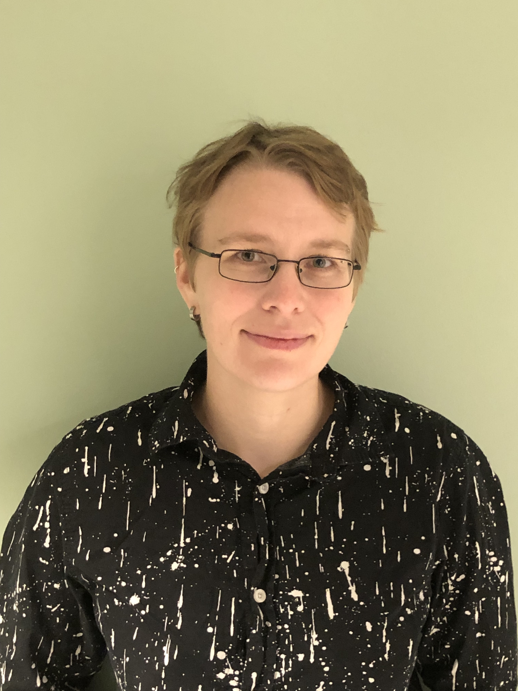

```{r setup, include=FALSE}
knitr::opts_chunk$set(echo = FALSE, out.width= "65%", out.extra='style="float:right; padding:10px"')
```


::: {.floatting}
```{r out.width='30%', out.extra='style="float:left; padding:20px"'}

```
<br><br><br>
[Amrei Binzer-Panchal, bioinformatician and coordinator at SLUBI (VH, Ultuna)](Amrei.html)
:::


::: {.floatting}
```{r out.width='30%', out.extra='style="float:right; padding:20px"'}

```
<br><br><br>
[Nicolas Delhomme, expert bioinformatician (S, Umeå)](Nicolas.html)
:::

::: {.floatting}
```{r out.width='30%', out.extra='style="float:left; padding:20px"'}

```
<br><br><br>
[Lizel Potgieter, expert bioinformatician (LTV, Alnarp)](Lizel.html)
:::


::: {.floatting}
```{r out.width='30%', out.extra='style="float:right; padding:20px"'}

```
<br><br><br>
[Adnan Niazi, expert bioinformatician (VH, Ultuna)](Adnan.html)
:::


::: {.floatting}
```{r out.width='30%', out.extra='style="float:left; padding:20px"'}

```
<br><br><br>
[Abu Bakar Siddique, expert bioinformatician (NJ, Ultuna)](Abu_Bakar.html)
:::
