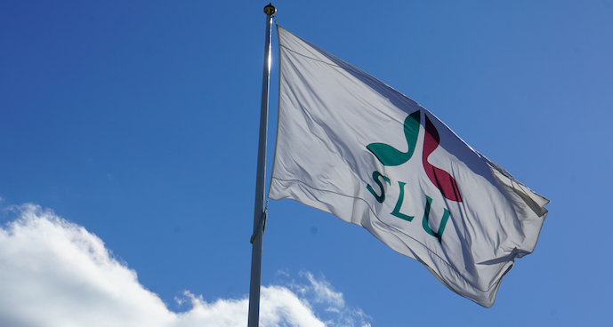

```{r setup, include=FALSE}
knitr::opts_chunk$set(echo = FALSE)

# Learn more about creating websites with Distill at:
# https://rstudio.github.io/distill/website.html

```

<center>
**Who are we: The SLU bioinformatics infrastructure**

Sveriges lantbruksuniversitet - Swedish University of Agricultural Sciences


Our goal is to provide support and training in bioinformatics for SLU staff, and to build a strong community of bioinformaticians within SLU. Our staff is located on the 3 SLU campuses in Ultuna, Umeå and Alnarp. We want to join forces and coordinate teaching activities, common resources (hardware, software).

</center>


<center>
  {#id .class width=75% height=75%}
</center>
